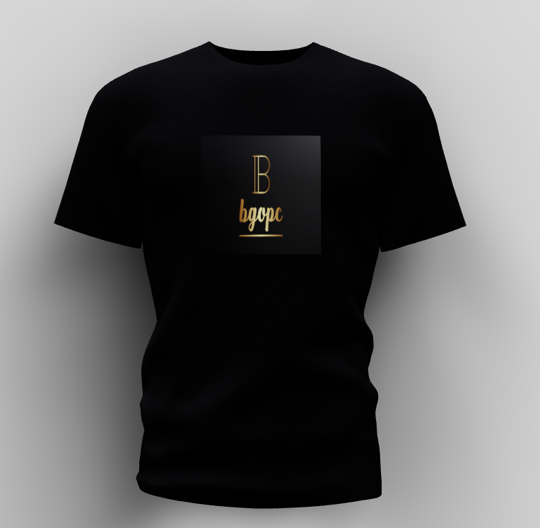
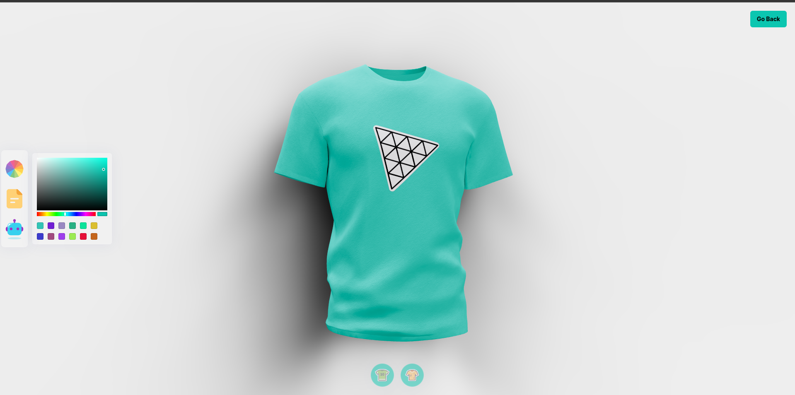
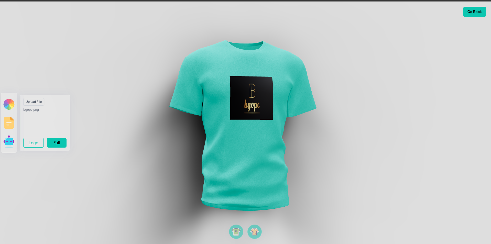

# Make You Shirt

Have you seen those fancy websites which let you customize image models,
It's one of those kinds

## React And Three.js

I'm using React and three.js to make a website which let you customize the image models and create your desire T-Shirt

#### Thanks To [Javascript Mastery](https://www.youtube.com/@javascriptmastery)

[Video Tutorial](https://www.youtube.com/watch?v=ZqEa8fTxypQ&ab_channel=JavaScriptMastery)

## Screen Shots

